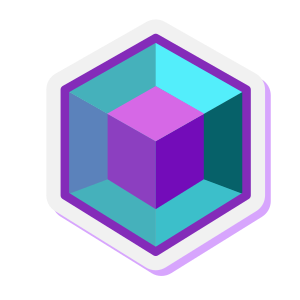

# Athena3D - Revolutionary AI-Powered 3D NFT Creation Platform

<div align="center">
  
  <br/>
  <br/>
  <a href="http://www.athena3d.online" target="_blank">
    
  </a>
  <a href="https://x.com/Athena3DAI" target="_blank">
    
  </a>
</div>

## Project Overview

Athena3D is a groundbreaking 3D content creation platform for the Web3 era, leveraging advanced AI technology and decentralized architecture to transform the digital content creation ecosystem. Our mission is to democratize 3D content creation through cutting-edge AI technology and decentralized architecture, eliminating technical barriers and empowering creators worldwide.

### Core Technical Features

- **Innovative Two-Stage Generation Process**: DiT shape generation and Paint texture synthesis
- **High-Resolution Texture Synthesis**: Utilizing advanced geometric and diffusion priors
- **Precise Conditional Image Alignment**: Achieving accurate detail preservation
- **Intelligent Cross-Domain Asset Transformation**: Adapting to multi-scenario application needs

## Technical Architecture

Athena3D is based on cutting-edge AI technology, employing an innovative two-stage generation process:

```javascript
// DiT Module - Shape Generation Stage Example Code
export const generateModelFromText = async (prompt, style = 'realistic') => {
  // Call AI backend service to generate the basic shape of the 3D model
  const shapeResponse = await apiClient.post('/api/generate/shape', {
    prompt,
    style,
    parameters: {
      complexity: 0.75,
      detail_level: 'high',
      geometric_precision: 0.85
    }
  });
  
  return shapeResponse.data;
};

// Paint Module - Texture Synthesis Stage Example Code
export const applyTextureToModel = async (modelId, textureParameters) => {
  // Apply high-quality textures to the generated 3D model
  const textureResponse = await apiClient.post(`/api/models/${modelId}/texture`, {
    style: textureParameters.style,
    material_type: textureParameters.materialType,
    color_palette: textureParameters.colorPalette,
    lighting_environment: textureParameters.lighting
  });
  
  return textureResponse.data;
};
```

### Smart NFT Contract Architecture

Our NFT smart contracts include advanced royalty mechanisms, ensuring creators receive earnings from secondary market sales:

```solidity
// Athena3DNFT Contract Royalty and Sale Function Example
function purchaseToken(uint256 tokenId) public payable nonReentrant {
    address seller = ownerOf(tokenId);
    require(seller != msg.sender, "Cannot buy your own token");
    require(_tokenListed[tokenId], "Token is not listed for sale");
    require(msg.value >= _tokenPrices[tokenId], "Insufficient funds sent");
    
    uint256 price = _tokenPrices[tokenId];
    uint256 royaltyAmount = 0;
    uint256 platformFee = (price * platformFeePercentage) / 10000;
    
    // Calculate royalties and pay the original creator
    address creator = _creators[tokenId];
    if (creator != seller && _royaltyPercentages[tokenId] > 0) {
        royaltyAmount = (price * _royaltyPercentages[tokenId]) / 10000;
        
        // Pay royalties to the creator
        (bool royaltySuccess, ) = payable(creator).call{value: royaltyAmount}("");
        require(royaltySuccess, "Royalty payment failed");
        
        emit RoyaltyPaid(tokenId, creator, royaltyAmount);
    }
    
    // Remaining code handles platform fees and seller payments...
}
```

## User Interface

Our meticulously designed user interface allows anyone to easily create professional-grade 3D NFTs:

```javascript
// Marketplace Component Example Code - Demonstrating User-Friendly NFT Trading Interface
const Marketplace = () => {
  const [nfts, setNfts] = useState([]);
  const [selectedNft, setSelectedNft] = useState(null);
  const [activeTab, setActiveTab] = useState('explore');
  const [filter, setFilter] = useState('all');
  
  // Code for filtering and sorting NFTs
  const filteredNfts = () => {
    let filtered = activeTab === 'explore' ? nfts : 
                  activeTab === 'my-nfts' ? userNfts : 
                  userNfts.filter(nft => nft.isListed);
    
    // Apply search filtering
    if (searchTerm.trim()) {
      filtered = filtered.filter(nft => 
        nft.name.toLowerCase().includes(searchTerm.toLowerCase()) ||
        nft.description.toLowerCase().includes(searchTerm.toLowerCase())
      );
    }
    
    // Apply sorting
    switch (filter) {
      case 'recent':
        return [...filtered].sort((a, b) => new Date(b.createdAt) - new Date(a.createdAt));
      case 'low-to-high':
        return [...filtered].sort((a, b) => parseFloat(a.price) - parseFloat(b.price));
      case 'high-to-low':
        return [...filtered].sort((a, b) => parseFloat(b.price) - parseFloat(a.price));
      default:
        return filtered;
    }
  };
  
  // Remaining interface rendering code...
};
```

## Token Economics

- **Name**: Athena (ATHE)
- **Total Supply**: 1 billion tokens
- **Issuance**: 100% fair launch
  - No pre-mining
  - No private sale
  - Community-driven distribution

Token Utility:
- Platform service fuel
- Asset trading mechanism
- Ecosystem governance
- Creator incentive system

## Application Scenarios

### Architecture and Urban Planning
- Digital city twin generation
- Historical architecture reconstruction
- Urban planning visualization

### Gaming and Metaverse
- Rapid game asset generation
- Virtual world scene construction
- Digital character creation

### Cultural Heritage and Education
- Digital museum exhibits
- Immersive educational resources
- Cultural heritage preservation

### Business and Marketing
- 3D product visualization
- Virtual exhibition halls
- Interactive advertising content

## Development Roadmap

- **Phase 1: Foundation** (2025 Q2-Q3)
  - Core AI model development
  - Basic platform infrastructure
  - Initial community building

- **Phase 2: Expansion** (2025 Q4-2026 Q2)
  - Cross-platform interoperability
  - Developer ecosystem development
  - Industry-specific solutions

- **Phase 3: Global Scaling** (2026 Q3-2027)
  - Comprehensive global expansion
  - Decentralized governance refinement
  - Innovation fund establishment

## Getting Started

1. Clone the repository
   ```bash
   git clone https://github.com/your-username/athena3d.git
   cd athena3d
   ```

2. Install dependencies
   ```bash
   npm install
   ```

3. Start the development server
   ```bash
   npm run dev
   ```

4. Access the application at http://localhost:3000

## Contact Us

- Official Website: [www.athena3d.online](http://www.athena3d.online)
- Twitter: [@Athena3DAI](https://x.com/Athena3DAI)

## License

The Athena3D project is licensed under the MIT License 